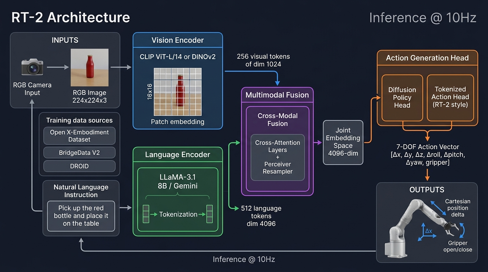
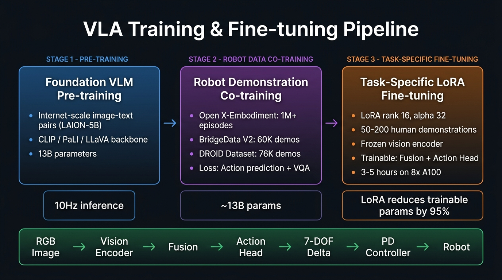

# Vision-Language-Action (VLA) Model Architecture
## Technical Specification: Closed-Loop Robotic Manipulation

---

## Architecture Schematics

### End-to-End Perception-to-Action Flow


### Training & Fine-Tuning Pipeline


---

## 1. Problem Formulation

We consider a robotic manipulation setup where a robotic arm (e.g., Franka Emika Panda, Universal Robots UR5e) equipped with an RGB sensor and a parallel-jaw gripper must execute natural-language commands:

$$\text{Task: "Pick up the red bottle and place it on the table."}$$

The system operates as a closed-loop Markov Decision Process (MDP) where at each timestep $t$:
- **Observation**: Current RGB image $\mathbf{I}_t \in \mathbb{R}^{224 \times 224 \times 3}$ and language instruction string $\mathbf{l}$.
- **Action**: End-effector displacement delta pose $\mathbf{a}_t = [\Delta x, \Delta y, \Delta z, \Delta\text{roll}, \Delta\text{pitch}, \Delta\text{yaw}, \text{gripper}] \in [-1, 1]^7$.
- **Control Frequency**: Steady 10 Hz ($\Delta t = 100\text{ ms}$ per control step).

The policy must ground semantic noun phrases (*"red bottle"*, *"table"*) to physical 3D locations in the workspace, resolve spatial affordances, and execute stable manipulation trajectories.

---

## 2. Foundation Model Selection & Trade-offs

| Model Base | Authors | Action Formulation | Strengths | Limitations in Practice |
|:---|:---|:---:|:---|:---|
| **RT-2** | Google DeepMind (2023) | Autoregressive discrete tokens (256 bins) | Web-scale co-training; emergent semantic reasoning. | 55B parameter footprint; high inference latency (~300 ms); closed weights. |
| **OpenVLA** | Kim et al. (2024) | Autoregressive discrete tokens (256 bins) | Open-source PyTorch implementation; state-of-the-art on BridgeV2; native Open X-Embodiment training. | Discrete binning yields stair-step action trajectories; token sequence overhead. |
| **$\pi_0$** | Physical Intelligence (2024) | Flow-matching (continuous) | Excellent high-frequency dexterous control. | Closed weights and proprietary training recipe. |
| **Octo** | Octo Model Team (2024) | Continuous diffusion head | Lightweight transformer; multi-robot support. | 93M backbone has limited visual reasoning and zero-shot generalization. |

**Selected Foundation**: We design a hybrid architecture utilizing the **OpenVLA backbone** (DINOv2 + LLaMA-3.1-8B) for web-scale semantic reasoning, replacing its discrete tokenized action head with a **Continuous Diffusion Policy Head** (Chi et al., 2023) to achieve smooth, multimodal action generation.

---

## 3. Architecture Components

### 3.1 Vision Encoder: DINOv2-ViT-L/14

```
RGB Observation [224 × 224 × 3]
       │
       ▼
DINOv2-ViT-L/14 (14×14 patch extraction → 16×16 spatial grid)
       │
       ▼
256 patch tokens × 1024-dim
       │
       ▼
Perceiver Resampler (Learnable cross-attention queries)
       │
       ▼
64 visual latent tokens × 4096-dim
```

- **Spatial Localization vs. Contrastive Embeddings**: Standard CLIP models maximize cosine similarity between global image embeddings and sentence captions, which discards local spatial geometry. In contrast, DINOv2's self-supervised training produces patch-level spatial features with strong semantic correspondence and depth sensitivity, allowing the model to accurately estimate object boundaries and grasping affordances.
- **Dimensionality Reduction via Perceiver Resampler**: The raw patch grid ($256$ tokens) is compressed to $64$ tokens via a Flamingo-style Perceiver Resampler with learnable query embeddings. This $4\times$ reduction accelerates subsequent cross-attention computation while projecting visual representations into the $4096$-dimensional embedding space of the language backbone.

---

### 3.2 Language Encoder: LLaMA-3.1-8B

```
Instruction String: "Pick up the red bottle and place it on the table"
       │
       ▼
LLaMA-3 Tokenizer (BPE, 128K vocabulary)
       │
       ▼
LLaMA-3.1-8B Transformer Backbone (Base weights frozen; LoRA on W_q, W_v)
       │
       ▼
77 language tokens × 4096-dim (Static KV-Cache enabled)
```

- **Static Instruction KV-Caching**: Because task instructions are static during an execution episode, the key-value matrices $K_{\text{lang}}, V_{\text{lang}}$ are computed once at $t=0$ and stored in GPU memory. During subsequent timesteps ($t \ge 1$), language processing overhead is $0\text{ ms}$, saving $\sim 40\text{ ms}$ per cycle.

#### 3.2.1 Modular LLM Backbone: Server vs. Edge Deployment

The decoupled projection interface allows flexible configuration based on physical compute constraints:

| Deployment Tier | Model Backbone | Parameter Count | Forward Pass Latency | Compute Target | Operational Profile |
|:---|:---|:---:|:---:|:---|:---|
| **Tier 1: High-Capacity Server (Default)** | **LLaMA-3.1-8B** | 8.03B | ~40 ms (0 ms cached) | Workstation RTX 4090 / A100 | Maximum semantic robustness, zero-shot generalization, complex spatial instruction parsing. |
| **Tier 2: Embedded Onboard Robot** | **LLaMA-3.2-3B** / **Gemma-2-2B** | 3.21B | ~15 ms (0 ms cached) | NVIDIA Jetson AGX Orin (64GB) | Self-contained on robot base, 30–50W power envelope, eliminates wireless network latency. |
| **Tier 3: Coordinate Extraction** | **Qwen2.5-VL-7B** | 7.6B | ~30 ms | Server / Workstation | Provides native bounding-box coordinate output tokens (`<box>`) for explicit visual tracking. |

---

### 3.3 Multimodal Fusion

```
Visual Latent Tokens [64 × 4096] ──────┐
                                       ▼
Language Tokens [77 × 4096] ───► Multi-Head Cross-Attention (8 heads)
                                       │
                                       ▼
                         6× Self-Attention Transformer Layers
                                       │
                                       ▼
                         Latent Conditioning Context c_t [1 × 4096]
```

- **Semantic-to-Spatial Grounding**: Language tokens act as queries attending over visual patch keys and values. When processing *"red bottle"*, cross-attention weights peak over patches representing the bottle geometry. The representations are transformed through 6 self-attention layers and pooled into a conditioning vector $\mathbf{c}_t \in \mathbb{R}^{4096}$.

---

### 3.4 Action Generation: Continuous Diffusion Policy

**Action Parameterization (7-DOF Delta Pose):**
$$\mathbf{a}_t = [\Delta x, \Delta y, \Delta z, \Delta\text{roll}, \Delta\text{pitch}, \Delta\text{yaw}, g] \in [-1, 1]^7$$
- $\Delta \mathbf{p} = [\Delta x, \Delta y, \Delta z]$: End-effector Cartesian position displacement, bounded to $[-2\text{ cm}, +2\text{ cm}]$.
- $\Delta \mathbf{r} = [\Delta\text{roll}, \Delta\text{pitch}, \Delta\text{yaw}]$: Orientation delta, bounded to $[-5^\circ, +5^\circ]$.
- $g \in [-1, 1]$: Gripper actuation state ($+1 = \text{open}, -1 = \text{close}$).

**Denoising Pipeline:**
```
Gaussian Prior ε ~ 𝒩(0, I₇)
       │
       ▼
10 DDIM Sampling Steps (Conditioned on latent c_t and diffusion step k)
       │
       ▼
Continuous Trajectory Chunk a_{t:t+H} (Horizon H = 8)
       │
       ▼
Execute first K = 4 steps / Recency-Weighted Temporal Ensembling
```

**Action Density Modeling: Diffusion vs. Regression vs. Tokenization:**
1. **Multimodal Action Distributions**: Grasping a symmetrical cylinder exhibits multimodal validity (approaching from left, right, or top). Mean Squared Error (MSE) regression averages these modes, generating an unfeasible trajectory through the center of the object. Diffusion models model the full distribution, deterministically sampling a single valid mode.
2. **Continuous Output vs. Discretization Bins**: Discretizing continuous joints into 256 categorical bins (RT-2, OpenVLA) causes high-frequency quantization noise and jerky motions. Continuous diffusion produces smooth end-effector trajectories with sub-millimeter precision.
3. **Action Chunking ($H=8$)**: Predicting trajectory segments rather than single-step actions smooths motor actuation and stabilizes control against network latency variations.

---

### 3.5 Low-Level Execution & PD Control

```
Predicted Action Vector a_t [7-DOF]
       │
       ▼
Safety Filter (Workspace bounding box, velocity limits, collision check)
       │
       ▼
Differential Inverse Kinematics (IK)
       │
       ▼
Joint Target Angles q_target
       │
       ▼
Joint PD Controller (Kp=200, Kd=10) → Motor Torques τ
       │
       ▼
Manipulator executes step (100 ms window) → Camera captures I_{t+1}
```

---

## 4. Training Data Strategy

| Stage | Dataset | Size | Purpose |
|:---:|:---|:---:|:---|
| **1: Vision-Language Alignment** | LAION-5B, LVD-142M | 5B pairs | Pretrained semantic representations in DINOv2 and LLaMA backbones. |
| **2: Robotic Manipulation Co-Training** | Open X-Embodiment (OXE) | 1M+ episodes | Generalist manipulation policy across 22 robot embodiments. |
| **2: Policy Prior Diversification** | BridgeData V2 & DROID | 136K demos | Tabletop pick-and-place trajectories, background variation, distractor objects. |
| **3: Target Task Fine-Tuning** | Task-Specific Demos | 100–200 demos | Target bottle grasp and placement on specific physical workstation via LoRA. |

---

## 5. Fine-Tuning Methodology

We freeze the pretrained vision encoder and the majority of the language transformer, applying Low-Rank Adaptation (LoRA) to adapt the system with high parameter efficiency:

```python
from peft import LoraConfig, get_peft_model

lora_config = LoraConfig(
    r=16,
    lora_alpha=32,
    target_modules=["q_proj", "v_proj", "cross_attn"],
    lora_dropout=0.05,
    bias="none",
    task_type="CAUSAL_LM"
)

model = get_peft_model(base_vla, lora_config)
# Trainable parameters: ~50M (0.6% of 8.4B total)
```

**Training Objective:**
$$\mathcal{L}_{\text{total}} = \mathbb{E}_{k, \mathbf{a}_0, \boldsymbol{\epsilon}} \left[ \|\boldsymbol{\epsilon} - \boldsymbol{\epsilon}_\theta(\mathbf{a}_k, k, \mathbf{c}_t)\|^2 \right] + \lambda \mathcal{L}_{\text{aux}}$$
where $\boldsymbol{\epsilon}_\theta$ is the noise prediction network, $k$ is the diffusion step, and $\mathcal{L}_{\text{aux}}$ ($\lambda = 0.05$) is an auxiliary visual grounding loss preventing degradation of spatial features.

- **Compute Budget**: Fine-tuning converges in $3$ to $5$ hours on an $8 \times \text{A100}$ ($80\text{GB}$) cluster (batch size $512$, AdamW optimizer, learning rate $1 \times 10^{-4}$).

---

## 6. Inference Pipeline & Latency Profile

Real-time closed-loop control at **10 Hz** requires the entire cycle to execute in **$< 100\text{ ms}$**:

```
RGB Frame (captured via camera sensor)
    │
    ▼ [15 ms]  Vision Encoder: DINOv2-ViT-L/14 + Perceiver Resampler (TensorRT FP8)
Visual Tokens [64 × 4096]
    │
    ▼ [ 0 ms]  Language Tokens (retrieved from Static KV-Cache; computed once at t=0)
Language Tokens [77 × 4096]
    │
    ▼ [10 ms]  Cross-Attention Multimodal Fusion (FlashAttention-2)
Conditioning Vector c_t [1 × 4096]
    │
    ▼ [20 ms]  Diffusion Action Head (10 DDIM denoising steps)
Action Chunk a_{t:t+8} [7-DOF continuous trajectory]
    │
    ▼ [ 3 ms]  Safety Layer (Cartesian envelope clamping, velocity limiter)
Joint Target Setpoints q_target
    │
    ▼ [30 ms]  Joint PD Control Tracking & Mechanical Actuation
Manipulator executes physical movement
    │
    ▼
Arm alters physical state → Camera captures new RGB frame I_{t+1} → Repeat loop at 10 Hz

Model Forward Pass Latency:    ~45 ms
Physical Control Execution:    ~35 ms
Total Closed-Loop Cycle:       ~80–85 ms  (Satisfies 100 ms budget for 10 Hz control loop)
```

---

## 7. Practical Deployment Considerations & Mitigations

| Challenge | Failure Mode | Engineering Mitigation |
|:---|:---|:---|
| **Latency Variations** | Diffusion sampling jitter causing dropped control cycles | 10-step DDIM deterministic scheduler; Action Chunking ($H=8$) executes smoothly through transient compute spikes. |
| **Multimodal Grasping** | Object approach ambiguity leading to trajectory averaging | Continuous diffusion modeling preserves distinct valid grasp modes. |
| **Quantization Artifacts** | High-frequency jitter from discrete binning | Continuous 7-DOF action output with Gaussian noise scheduling eliminates discretization boundaries. |
| **Sim-to-Real Domain Gap** | Model failure under novel tabletop lighting or reflections | Extensive domain randomization (camera extrinsics, lighting, textures) during Stage 2 + 100 teleoperated real demos. |
| **Object Misidentification** | Distractor confusion (e.g., picking a red cup instead of a red bottle) | DINOv2 localized patch attention cross-referenced with an asynchronous YOLO-v8 object verifier. |
| **Physical Safety Violations** | Out-of-distribution neural network commands causing self-collisions | Cartesian workspace bounding box ($|\Delta \mathbf{p}| \le 2\text{ cm}$), velocity clamping, and wrist force-torque thresholding ($>20\text{ N}$). |
| **Edge Compute Bounds** | Exceeding mobile base VRAM limits | AWQ 4-bit weight quantization allows model execution within 16GB VRAM on an NVIDIA Jetson AGX Orin. |
| **Command Ambiguity** | Incomplete instructions (e.g., "put it down") | Fallback to default tabletop drop zone or visual confirmation prompt. |

---

## 8. Technical Specification Summary

| System Parameter | Value / Implementation |
|:---|:---|
| **Vision Backbone** | DINOv2-ViT-L/14 ($14\times14$ patch, $256$ patches $\rightarrow$ Perceiver $64$ tokens) |
| **Language Backbone** | LLaMA-3.1-8B (Static KV-cache, LoRA rank 16 on $W_q, W_v$) |
| **Fusion Mechanism** | 6-layer Cross-Attention Transformer (8 attention heads) |
| **Action Head** | Continuous Diffusion Policy (10 DDIM steps, Action Chunking $H=8$) |
| **Action Space** | Continuous 7-DOF: $[\Delta x, \Delta y, \Delta z, \Delta\text{roll}, \Delta\text{pitch}, \Delta\text{yaw}, \text{gripper}] \in [-1, 1]^7$ |
| **Control Rate** | 10 Hz closed-loop ($\Delta t = 100\text{ ms}$) |
| **Total Parameters** | ~8.4 Billion |
| **Trainable Parameters** | ~50 Million ($0.6\%$ of base weights) |
| **Forward Pass Latency** | ~45 ms (TensorRT FP8 on RTX 4090 / A100) |
| **End-to-End Cycle Time** | ~80–85 ms (including safety checks and PD controller actuation) |

---

## 9. References

1. Brohan, A., et al. (2023). **RT-2: Vision-Language-Action Models Transfer Web Knowledge to Robotic Control**. arXiv:2307.15818.
2. Kim, M. J., et al. (2024). **OpenVLA: An Open-Source Vision-Language-Action Model**. arXiv:2406.09246.
3. Chi, C., et al. (2023). **Diffusion Policy: Visuomotor Policy Learning via Action Diffusion**. Robotics: Science and Systems (RSS).
4. Black, K., et al. (2024). **$\pi_0$: A Vision-Language-Action Flow Model for Generalist Robots**. Physical Intelligence.
5. Alayrac, J. B., et al. (2022). **Flamingo: A Visual Language Model for Few-Shot Learning**. NeurIPS.
6. Open X-Embodiment Collaboration (2024). **Open X-Embodiment: Robotic Datasets and RT-X Models**. arXiv:2310.08864.
7. Oquab, M., et al. (2023). **DINOv2: Learning Robust Visual Features without Supervision**. arXiv:2304.07193.
8. Hu, E. J., et al. (2022). **LoRA: Low-Rank Adaptation of Large Language Models**. ICLR.
9. Driess, D., et al. (2023). **PaLM-E: An Embodied Multimodal Language Model**. ICML.
10. Khazatsky, A., et al. (2024). **DROID: A Large-Scale In-The-Wild Robot Manipulation Dataset**. arXiv:2403.12945.
